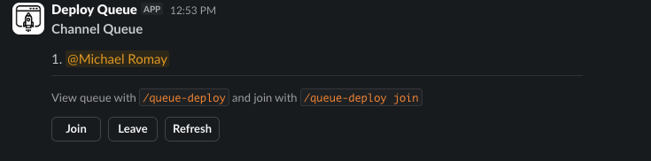

# Deploy Queue Bot

Slack bot that manages per-channel deploy queues using Redis for ordering and Bolt for interactivity. Team members can join, leave, and advance the queue via slash commands or message buttons, while the bot keeps a single up-to-date queue message in the channel.



## Features

- `/deploy-queue` slash command with `join`, `leave`, `next`, and default `show` actions.
- Interactive message buttons for join/leave/refresh alongside the queue display.
- Automatic reposting of the queue message so the latest state always appears at the bottom of the channel.
- Optional DM when a user becomes first in line (`NOTIFY_DM`).
- Automatic pruning of stale queue entries based on configurable age (`QUEUE_MAX_AGE_HOURS`).
- Redis-backed storage with Docker Compose configuration for local development or deployment.

## Prerequisites

- Node.js 20+ (only needed if you run outside Docker).
- A Slack workspace where you can create/install a Socket Mode app.
- Redis (local Redis container provided via Compose).

## Environment Variables

Create a `.env` file (never commit real secrets) with at least:

```env
SLACK_BOT_TOKEN= # xoxb- token from Slack Bot User OAuth
SLACK_SIGNING_SECRET= # Signing secret from Slack Basic Information
SLACK_APP_LEVEL_TOKEN= # xapp- token with connections:write for Socket Mode
PORT=3000
REDIS_URL=redis://127.0.0.1:6379

# Optional:
NOTIFY_DM=true            # DM whoever becomes first in the queue
QUEUE_MAX_AGE_HOURS=12    # Auto-remove entries older than N hours; <=0 disables pruning
NODE_ENV=development
```

When running via Docker Compose, `REDIS_URL` is provided automatically as `redis://redis:6379`. Secrets are passed through from your local `.env`.

## Slack App Setup

1. Create a Slack app and enable Socket Mode.
2. Grant the bot scopes you need (e.g., `commands`, `chat:write`, `im:write`, `groups:read`, `channels:read`, `app_mentions:read` as required).
3. Create a slash command `/deploy-queue` that points to any request URL (unused in Socket Mode) and install the app to your workspace.
4. Copy the Bot Token, Signing Secret, and App-Level Token into your `.env`.

## Local Development

### Using Docker Compose (recommended)

```bash
docker compose up --build
```

- Starts Redis and the bot.
- The bot runs in Socket Mode so no external port mapping is required.

### Running with Node.js

```bash
npm install
npm run build
SLACK_BOT_TOKEN=... SLACK_SIGNING_SECRET=... SLACK_APP_LEVEL_TOKEN=... npm run start
```

Ensure Redis is available at the `REDIS_URL` you configured.

## Usage

- `/deploy-queue` shows the current queue and posts/updates the channel message.
- `/deploy-queue join` adds you to the queue. First-time joins do not ping the channel if the queue was empty.
- `/deploy-queue leave` removes you and posts a note mentioning the next person up.
- `/deploy-queue next` pops the next person, announces them, and refreshes the queue.
- Message buttons (Join/Leave/Refresh) provide the same functionality without typing commands.

Each update removes the previous queue message and posts a fresh one containing:

- A numbered list of the queue
- Recent action note (e.g., who left and who is up next)
- Tips on viewing/joining the queue in inline code formatting
- Buttons for quick actions

Users who become first in line can optionally receive a direct message if `NOTIFY_DM=true`.

## Redis Data

- Queue membership is stored in sorted sets keyed by team and channel.
- Last posted queue message timestamp is tracked to support reposting.
- The `redis-data/` directory is ignored by Git and Docker images; it holds local persistence for the development Redis container.

## Contributing

1. Fork and clone this repository.
2. Create a feature branch.
3. Run tests or linting you add as needed.
4. Open a pull request describing your changes.

## License

MIT (or update this section if a different license applies).
